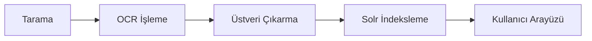

## Proje Özeti

TBMM'nin parlamento tarihine ait milyonlarca belgenin dijitalleştirilmesi ve erişilebilir hale getirilmesi projesinde kullanılan teknik mimariyi paylaşıyorum.

## Mimari Bileşenler

### Backend

- **.NET Core** — Ana uygulama çatısı
- **PostgreSQL** — İlişkisel veritabanı
- **Apache Solr** — Tam metin arama motoru
- **RabbitMQ** — Asenkron iş kuyruğu

### Dijitalleştirme Pipeline'ı

### OCR Pipeline

Osmanlıca ve Türkçe belgeler için özel OCR iş akışı:

1. Taranmış görüntü ön işleme (gürültü temizleme, eşikleme)
2. Tesseract OCR motoruna özel dil modelleri entegrasyonu
3. Çıktı kalite kontrolü ve manuel düzeltme arayüzü

### Arama Mimarisi

Solr üzerinde özelleştirilmiş şema:

- **Çok dilli analiz:** Türkçe ve Osmanlıca metin işleme zincirleri
- **Facet'leme:** Belge türü, tarih aralığı, dil
- **Yazım düzeltme:** Osmanlıca karakter varyasyonları için fuzzy matching

## Öğrenilen Dersler

1. Büyük ölçekli belge işlemede asenkron mimari şart
2. Solr tuning, sorgu performansı için kritik
3. OCR kalite kontrolü için insan-in-the-loop yaklaşımı gerekli

Proje hakkında daha fazla bilgi için [AA haberini](https://www.aa.com.tr/tr/gundem/turkiyenin-parlamento-tarihi-dijital-arsive-aktariliyor/3403354) okuyabilirsiniz.
